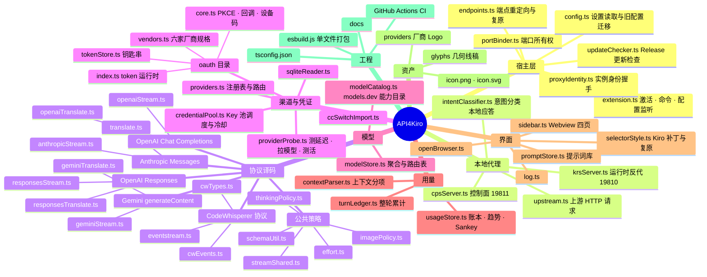

<p align="center">
  
</p>

<h1 align="center">API4Kiro</h1>

<p align="center">
  <a href="https://github.com/yourhoneypomelo-cell/API4Kiro/releases/latest"></a>
  <a href="https://github.com/yourhoneypomelo-cell/API4Kiro/actions/workflows/ci.yml"></a>
  <a href="https://github.com/yourhoneypomelo-cell/API4Kiro/releases"></a>
  
  <a href="LICENSE"></a>
</p>

把多家 API 聚合接入 [Kiro](https://kiro.dev) IDE：厂商账号登录（Kimi / Codex / xAI / Antigravity / Anthropic / Kiro 官方多账号）、第三方 Key、自定义端点（Anthropic Messages / OpenAI Chat Completions / OpenAI Responses / Gemini 四种格式）；所有渠道的模型合并进 Kiro 的模型选择器、按模型自动路由，支持 Key 池轮换与冷却、思考档位、模型测活、本地用量账本、Context Usage 真实窗口、提示词注入，改动无需重载即静默同步到 Kiro。

> 本项目是 [SunNorthGod/API2Kiro](https://github.com/SunNorthGod/API2Kiro) 的多渠道演进版（"dual" 起步，现为 N 渠道聚合），MIT 许可。

---

## 目录

- [快速开始](#快速开始)
- [接入方式](#接入方式)
- [侧边栏面板](#侧边栏面板)
- [多渠道路由与 Key 池](#多渠道路由与-key-池)
- [思考档位](#思考档位)
- [用量与上下文](#用量与上下文)
- [稳健性](#稳健性)
- [Kiro 前端补丁（重要）](#kiro-前端补丁重要)
- [命令面板](#命令面板)
- [配置项](#配置项)
- [项目结构](#项目结构)
- [技术栈](#技术栈)
- [文档](#文档)
- [从源码构建](#从源码构建)
- [致谢](#致谢)
- [许可证](#许可证)
- [重要免责声明](#重要免责声明)

## 快速开始

```bash
# 1. 到 Releases 下载最新 api2kiro-dual-<version>.vsix
#    https://github.com/yourhoneypomelo-cell/API4Kiro/releases/latest
# 2. 安装（也可在 Kiro 扩展面板右上角 ··· → 「从 VSIX 安装」）
kiro --install-extension api2kiro-dual-<version>.vsix --force
# 3. Kiro 内 Ctrl/Cmd+Shift+P → Developer: Reload Window
```

> 装过原版 API2Kiro 的用户：两者共用 Kiro 的 `codewhisperer.config.*Endpoints`，同一时间只能有一个生效。先在原版设置里把 `api2kiro.enabled` 设为 `false`，再启用本扩展。端口已错开（本扩展 19810 / 19811，原版 19800 / 19801），两者可以同时安装。

三步接入：

1. 点击活动栏的 API4Kiro 图标 → **提供商** 页 → 添加渠道（账号登录 / API Key / 自定义端点，或从 CC Switch 一键导入）
2. **模型** 页勾选要进入 Kiro 的模型（严格 opt-in，未勾选的不会出现在 Kiro 里）
3. **设置** 页打开「启用代理」→ 按提示重载窗口一次

之后增删模型、调整顺序都会静默同步到 Kiro 右侧的模型选择器，不再需要重载。

> 需要 Kiro IDE（本扩展声明依赖内置的 `kiro.kiroAgent`），纯 VS Code 中不会激活。已在 Kiro 1.0.411 与 1.0.437 上验证。

## 接入方式

| 方式 | 适用 | 凭证存放 |
| --- | --- | --- |
| **厂商账号登录（OAuth）** | Kimi、Codex（OpenAI）、xAI、Antigravity（Google）、Anthropic（Claude）、Kiro 官方多账号 | 系统钥匙串（VS Code SecretStorage），不落盘到设置文件 |
| **第三方 API Key** | 中转站、官方 Key；同一渠道可放多把 Key 组成 Key 池 | `api2kiroDual.providers` 设置项 |
| **自定义端点** | 任意 Anthropic Messages / OpenAI Chat Completions / OpenAI Responses / Gemini generateContent 兼容服务 | 同上 |
| **从 CC Switch 导入** | 只读解析 `~/.cc-switch/cc-switch.db`，把 [CC Switch](https://github.com/farion1231/cc-switch) 里配好的供应商一键转成渠道 | 同上 |

每个渠道可单独设置：协议与子模式（`anthropic` 的 kiro 深度兼容 / official 直通；`openai` 的 chat / responses）、精确前缀 `exactBase`、模型 ID 映射 `modelMapping`、能力覆盖 `modelOverrides`（图片 / 推理）、白名单 `enabledModels`、兜底模型、Logo。面板里还能对草稿渠道**测延迟 / 拉取模型 / 测活**（并发 3，可达但报错的用黄色标出）。

## 侧边栏面板

| 页面 | 说明 |
| --- | --- |
| **提供商** | 渠道增删改、拖拽排序（支持滚轮与边缘自动滚动）、连接测试、Key 池管理、从 CC Switch 导入、Logo 图库 |
| **模型** | 各渠道模型勾选进 Kiro、能力覆盖（图片 / 推理）、拖拽排序；改动经「通道 A」静默刷新 Kiro 选择器 |
| **用量** | 趋势图（Token / 请求两个维度；「今天」按 10 分钟粒度显示消耗尖峰，7 / 30 天按天）、Sankey 流向图（Token 物理守恒，门高与流宽严格按数值）、按渠道 / 模型汇总、缓存命中率 |
| **设置** | 启用代理、路由 / 思考 / 重试 / 显示选项、提示词库（单条启用，作为 system 注入）、「关于」卡（版本、GitHub 项目主页、检查更新） |

## 多渠道路由与 Key 池

- **合并与路由**：所有启用且配置完整的渠道，其勾选的模型合并进 Kiro 模型选择器；请求按所选模型 ID 路由到拥有该模型的渠道（同名模型优先 Anthropic 通道）。
- **分组显示**（`api2kiroDual.modelListStyle`）：`grouped` 按渠道分节并加标题行（默认）/ `suffix` 模型名加「(渠道名)」/ `plain` 只显示模型名；只有一个渠道时不加任何标记。
- **Key 池**（`poolStrategy`）：`priority` 主备（固定用最优先的一把，挂了才切；同一会话粘住同一把，粘性 2 小时）/ `least-used` 均衡（新会话选累计使用最少的一把）。
- **失败分类与冷却**：鉴权失败 15 分钟、额度用尽 30 分钟、403 15 分钟、限流按上游 `Retry-After`（无该头时 1 分钟）且不超过 10 分钟；冷却是「避让」而非「封锁」——到点自动回池，池里其它 Key 照常服务。

## 思考档位

**Anthropic 通道**

- `thinking` `auto / enabled / disabled`：extended thinking 开关，`auto` 按模型名是否含 `thinking` 决定；`thinkingBudget` 未选档位时的预算。
- `effortMode` `auto / modelVariant / thinkingBudget / off`：决定 Kiro 档位选择器显示哪些档。`auto` 只显示**有证据支持**的档位——上游声明的官方档位，或模型列表里真实存在的 `model-档位` 变体（如 `deepseek-v4-pro` 的 none / max），都没有就不显示，避免臆造上游不认的档位。
- `reasoningMode` `auto / standard / pro`：GPT 5.6 系列（sol / terra / luna）的思考模式。

**OpenAI 通道**

- `openaiReasoningEffort`：把 Kiro 选的档位发给上游。models.dev 声明了 effort 取值的模型原样透传，否则折成 low / medium / high，且只对推理模型发送（非推理模型收到该字段可能 400）。
- `openaiReasoningEcho`：是否把上一轮 `reasoning_content` 随历史带回（Preserved / Interleaved Thinking）。`auto` 只对要求回传的家族（GLM-4.7+ / 5.x、DeepSeek V3.2+ / V4、Kimi K2 / K3）。
- `openaiThoughtDedupe`：模型把回答先写进思考通道、正文再答一遍时（GLM-5.3 常见）的去重策略，`exact` 默认只在正文与思考开头一致时丢弃思考，不丢任何文字。
- `openaiMaxTokensField`：`max_tokens / max_completion_tokens / both / none`，适配不同网关对输出长度字段的要求。

## 用量与上下文

- **每轮页脚**（`showTokenUsage`）：在 Kiro 回答页脚标注本轮消耗的 Est. Input / Output Tokens；工具循环里的多次请求会累计成一轮后再上报，避免 Kiro 重复聚合。
- **本地账本**：每个请求的 token 由本扩展自己记账，不依赖中转站的用量接口；用量页的趋势、Sankey、汇总都来自这份账本。也可填 `usagePath` 走中转站的额度接口（kiro2cc-proxy 风格或 New-API 风格）。
- **Context Usage 弹层**：Kiro 底栏的 Context Usage 悬停弹层显示**真实模型窗口**（来自模型目录的 `maxInputTokens`，例如 1M）与系统提示 / 历史 / 工具 / 附件等分项占用，不再是反推出来的假窗口。

## 稳健性

- **自动重试**（`autoRetry` / `maxRetries`）：上游流在**尚未吐出任何内容**时中断则透明重发；已开始输出正文或思考后中断不重试，避免重复内容。
- **纯文本模型剥图**（`textOnlyModels`）：Kiro 的附件按钮不按模型能力禁用，发往不支持图片的模型时自动剥离图片（包括历史消息里的，否则一张图会让整个对话永久 400）；某模型因图片被上游拒绝时会被自动记住。
- **意图分类本地拦截**（`interceptIntentClassifier`）：Kiro 每轮的 simple-task 分类请求在本地应答，省一次上游调用。
- **多窗口**：多个 Kiro 窗口共用同一对端口，先启动的窗口作主实例服务所有窗口；扩展升级后旧实例会被识别并让位。
- **调试日志**（`debug`）：请求 / 响应写入日志文件，Key 自动脱敏；命令面板 **API4Kiro: 打开调试日志** 直达。

## Kiro 前端补丁（重要）

为了让渠道分组标题有样式、Context Usage 弹层显示真实窗口、模型列表改动不重载即同步，本扩展会在 **Kiro 安装目录**的 kiro-agent 文件末尾追加带标记的补丁：

| 靶文件 | 作用 |
| --- | --- |
| `extensions/kiro.kiro-agent/packages/kiro-ui-agent-chat/dist/style.css` | 模型选择器分组标题 / 卡片样式、弹层样式 |
| `extensions/kiro.kiro-agent/packages/kiro-ui-agent-chat/dist/assets/mermaid-*.js` | 模型选择器组头渲染、Context Usage 弹层 |
| `extensions/kiro.kiro-agent/dist/extension.js` | 模型刷新钩子（「通道 A」静默刷新） |

设计约束：

- **可逆**：每段补丁带 `a2k` 标记；被替换的函数原文以 base64 随身携带，复原时精确回填。关闭代理或关闭 `api2kiroDual.groupHeaderStyle` 即移除。
- **不写死压缩名**：Kiro 自动升级会改变压缩后的函数名，补丁按代码结构匹配、名字用正则捕获，全有或全无——任一靶点漂移则三处都不写，绝不留下半套。
- **升级自愈**：Kiro 升级覆盖了靶文件后，下次激活自动重新打补丁并提示重载一次。
- **停用后的状态**：为避免每次重载都把钩子抹掉（kiro-agent 先于本扩展加载磁盘文件），窗口关闭时三份文件保持补丁态；此时没有本扩展运行，补丁对 Kiro 原生行为无可见影响。

## 命令面板

| 命令 | 说明 |
| --- | --- |
| `API4Kiro: 打开控制面板` | 聚焦侧边栏 |
| `API4Kiro: 启用 / 关闭代理` | 切换 `api2kiroDual.enabled` |
| `API4Kiro: 管理 Providers（打开面板）` | 打开提供商页 |
| `API4Kiro: 刷新活跃会话模型列表` | 手动触发「通道 A」刷新 Kiro 选择器 |
| `API4Kiro: 刷新用量 / 缓存命中率` | 重新拉取用量 |
| `API4Kiro: 清除"不支持图片"的模型记录` | 清空自动学习到的纯文本模型名单 |
| `API4Kiro: 打开调试日志` | 打开日志文件 |

## 配置项

常用项（完整 41 项见 [docs/CONFIGURATION.md](docs/CONFIGURATION.md)，由 `package.json` 自动生成）：

| 设置项 | 默认 | 说明 |
| --- | --- | --- |
| `api2kiroDual.enabled` | `false` | 启用代理；与原版 API2Kiro 互斥 |
| `api2kiroDual.providers` | `[]` | 渠道注册表，一般在面板里维护 |
| `api2kiroDual.modelListStyle` | `grouped` | 多渠道时模型来源的标记方式 |
| `api2kiroDual.groupHeaderStyle` | `true` | 分组标题样式（Kiro 前端补丁总开关） |
| `api2kiroDual.port` / `cpsPort` | `19810` / `19811` | 本地运行时 / 控制面端口 |
| `api2kiroDual.maxTokens` | `32000` | 向上游请求的最大输出 token |
| `api2kiroDual.thinking` / `thinkingBudget` / `effortMode` | `auto` / `8192` / `auto` | Anthropic 通道思考策略 |
| `api2kiroDual.openaiReasoningEffort` / `openaiReasoningEcho` / `openaiThoughtDedupe` | `auto` / `auto` / `exact` | OpenAI 通道思考策略 |
| `api2kiroDual.autoRetry` / `maxRetries` | `true` / `2` | 流中断自动重试 |
| `api2kiroDual.showTokenUsage` | `true` | 每轮页脚标注 token |
| `api2kiroDual.textOnlyModels` | `[]` | 不支持图片的模型（自动学习） |
| `api2kiroDual.interceptIntentClassifier` | `true` | 本地拦截意图分类请求 |
| `api2kiroDual.debug` | `false` | 写调试日志（Key 脱敏） |

`codewhisperer.config.*Endpoints` 三项由扩展自动管理（把 Kiro 的请求重定向到本地代理），请勿手动编辑。

## 项目结构

### 思维导图



### 目录树

```
API4Kiro/
├── src/
│   ├── extension.ts            激活 / 停用、命令注册、配置监听；启停本地代理与 Kiro 补丁；启动时静默检查更新
│   ├── config.ts               读取并规范化 api2kiroDual.* 设置（含旧版双通道配置自动迁移）
│   ├── endpoints.ts            Kiro codewhisperer.config.*Endpoints 的备份 / 重定向 / 复原
│   ├── portBinder.ts           多窗口固定端口所有权：让位 / 接管
│   ├── proxyIdentity.ts        本地代理身份握手（识别同类实例与升级后的旧实例）
│   ├── updateChecker.ts        GitHub Release 更新检查（启动静默 24h 节流 / 手动）
│   │
│   ├── krsServer.ts            运行时反代：Kiro 请求 → 路由 → 译码 → 上游 → 流式回写 CW 事件；重试、剥图
│   ├── cpsServer.ts            控制面：模型列表广播（含能力 / 窗口 description）、测活、用量查询
│   ├── intentClassifier.ts     Kiro simple-task 意图分类请求的本地应答
│   ├── upstream.ts             上游 HTTP(S) 请求与流式读取
│   │
│   ├── translate.ts            CW → Anthropic Messages 请求体
│   ├── anthropicStream.ts      Anthropic SSE → CW 事件
│   ├── openaiTranslate.ts      CW → OpenAI Chat Completions 请求体
│   ├── openaiStream.ts         Chat Completions SSE → CW 事件
│   ├── responsesTranslate.ts   CW → OpenAI Responses 请求体
│   ├── responsesStream.ts      Responses 类型化事件流 → CW 事件
│   ├── geminiTranslate.ts      CW → Gemini generateContent（Gemini 官方 / Antigravity 共用内层请求）
│   ├── geminiStream.ts         Gemini SSE → CW 事件
│   ├── streamShared.ts         各协议流回写共用的事件合成与状态
│   ├── thinkingPolicy.ts       OpenAI 兼容通路各家「思考」方言（强制思考、回传、去重）
│   ├── effort.ts               思考档位与 thinking 预算的映射
│   ├── imagePolicy.ts          纯文本模型的图片剥离与自学习
│   ├── schemaUtil.ts           工具参数 JSON Schema 整理（内联本地 $ref）
│   ├── eventstream.ts          AWS application/vnd.amazon.eventstream 二进制编解码
│   ├── cwEvents.ts             CodeWhisperer 事件构造
│   ├── cwTypes.ts              CodeWhisperer 请求 / 事件类型
│   │
│   ├── providers.ts            Provider 注册表：N 个上游接入点的模型合并与按模型 ID 路由
│   ├── credentialPool.ts       Key 池调度：主备 / 均衡、失败分类与冷却、会话粘性
│   ├── providerProbe.ts        草稿渠道的测延迟 / 拉取模型 / 测活
│   ├── ccSwitchImport.ts       从 CC Switch 只读导入渠道
│   ├── sqliteReader.ts         零依赖只读 SQLite 页解析器
│   ├── oauth/
│   │   ├── core.ts             PKCE、state、本机回调服务器、设备码轮询、JWT 载荷解析
│   │   ├── vendors.ts          厂商登录规格：Kimi / Codex / xAI / Antigravity / Anthropic / Kiro
│   │   ├── index.ts            OAuth 运行时：请求前取新鲜 token（并发只刷一次）、登录会话
│   │   └── tokenStore.ts       token 仓（系统钥匙串，按 provider / credential 键）
│   │
│   ├── modelStore.ts           模型聚合与「模型 ID → provider」路由表；学到的模型名单
│   ├── modelCatalog.ts         models.dev 模型能力目录缓存（图片 / 思考形态 / 上下文窗口）
│   │
│   ├── usageStore.ts           本地用量账本：趋势、Sankey、分项聚合
│   ├── turnLedger.ts           一轮对话（工具循环多请求）的用量累计与轮末上报
│   ├── contextParser.ts        请求上下文成分解析：五类字符权重与 token 无损分配
│   │
│   ├── sidebar.ts              侧边栏 Webview：提供商 / 模型 / 用量 / 设置四页与图表
│   ├── selectorStyle.ts        Kiro 模型选择器样式、Context Usage 弹层、模型刷新钩子的补丁与复原
│   ├── promptStore.ts          提示词库（单条启用，注入 system）
│   ├── openBrowser.ts          系统浏览器打开链接（绕开 Kiro 的二次确认）
│   └── log.ts                  输出通道与调试日志文件（Key 脱敏）
│
├── assets/
│   ├── icon.png / icon.svg     扩展图标 / 活动栏单色图标
│   ├── providers/              厂商 Logo（SVG + PNG 剪影）+ LICENSE.md
│   ├── glyphs/                 自绘几何线稿 Logo（自定义渠道可选）
│   ├── ccswitch.png            CC Switch 标识（导入入口）
│   └── ICON-LICENSE.md         图标与第三方标识的许可说明
│
├── docs/
│   ├── ARCHITECTURE.md         架构概览：请求流程、模块边界、Key 池状态机、Kiro 补丁机制
│   └── CONFIGURATION.md        全部配置项参考（由 package.json 生成）
├── scripts/
│   └── gen-config-doc.js       生成 docs/CONFIGURATION.md
├── .github/
│   ├── workflows/ci.yml        push / PR：npm ci → tsc → 打包并上传 vsix；v* tag：挂到 Release
│   └── ISSUE_TEMPLATE/         Bug 报告 / 功能建议表单
│
├── esbuild.js                  打包为单文件 dist/extension.js（含可选 client secret 注入）
├── tsconfig.json
├── package.json                扩展清单：命令、视图、41 个配置项、extensionDependencies
├── .vscodeignore               vsix 只含 dist/、assets/、package.json、LICENSE、README
├── CONTRIBUTING.md
├── LICENSE                     MIT
└── README.md
```

## 技术栈

- **语言与构建**：TypeScript 5.5 · esbuild 0.23 打成单文件 CommonJS（`dist/extension.js`，≈ 0.9 MB）· `@vscode/vsce` 打包 · **零运行时 npm 依赖**
- **宿主**：VS Code Extension API `^1.90`（Kiro）· Webview 用原生 HTML / CSS / JS，不引前端框架 · `SecretStorage` 存 OAuth token
- **网络**：Node `http` / `https` / `net` 实现本地反代与多窗口端口协商 · 自实现 AWS eventstream 二进制编解码 · SSE 解析
- **协议**：Anthropic Messages · OpenAI Chat Completions / Responses · Gemini generateContent · Kiro CodeWhisperer
- **认证**：OAuth 2.0 授权码 + PKCE / 设备码；Kimi、OpenAI（Codex）、xAI、Google（Antigravity）、Anthropic、Kiro 六家
- **数据**：零依赖 SQLite 页解析器（CC Switch 导入）· `globalState` 持久化账本与模型名单 · [models.dev](https://models.dev) 公共模型目录（可缺席）
- **工程**：GitHub Actions CI（Node 22，构建 + 打包 + 产物上传，tag 自动发 Release）· Conventional Commits

## 文档

| 文档 | 内容 |
| --- | --- |
| [docs/ARCHITECTURE.md](docs/ARCHITECTURE.md) | 系统架构图、一次请求的完整流程、模块边界、Key 池状态机、Kiro 前端补丁机制与复原、多窗口协商、已知限制 |
| [docs/CONFIGURATION.md](docs/CONFIGURATION.md) | 全部 41 个配置项：类型、默认值、取值与说明（`node scripts/gen-config-doc.js` 从 `package.json` 生成） |
| [CONTRIBUTING.md](CONTRIBUTING.md) | 环境搭建、Issue / PR 约定、发布流程 |
| [assets/ICON-LICENSE.md](assets/ICON-LICENSE.md) · [assets/providers/LICENSE.md](assets/providers/LICENSE.md) | 图标与第三方标识的来源与许可 |

## 从源码构建

```bash
git clone https://github.com/yourhoneypomelo-cell/API4Kiro.git
cd API4Kiro
npm ci
npm run compile          # tsc 类型检查
npm run package          # esbuild 打包 + vsce 生成 api2kiro-dual-<version>.vsix
kiro --install-extension api2kiro-dual-<version>.vsix --force
```

需要 Node.js 18 或更高版本（CI 使用 Node 22）。

- **Antigravity 登录的 client secret 不在仓库里**（Google 会自动吊销出现在公开仓库的 `GOCSPX-` 密钥）。构建时通过环境变量 `A2K_ANTIGRAVITY_CLIENT_SECRET` 或仓库根目录的 `antigravity.secret` 文件（已 gitignore）注入；缺省时构建照常成功，只是 Antigravity 登录不可用。Release 里的 vsix 已内置，可直接使用。
- 回归测试套件（约 1,700 项，覆盖译码、路由、Key 池、握手、补丁可逆性等）在作者本地维护，因其中包含 Kiro 编译产物的只读副本，未随公开仓发布；CI 只做类型检查与打包。

## 致谢

- [SunNorthGod/API2Kiro](https://github.com/SunNorthGod/API2Kiro) — 本项目的起点，MIT
- 设计参考：kiro.rs（[hank9999](https://github.com/hank9999/kiro.rs) / [ZyphrZero](https://github.com/ZyphrZero/kiro.rs)）的 `MultiTokenManager` 与 [kiro.qizhu](https://github.com/chenjie897532119/kiro.qizhu) 的 `pool/scheduler.go`（凭证池调度）、[CLIProxyAPI](https://github.com/router-for-me/CLIProxyAPI) 的 OAuth 流程、[cc-switch](https://github.com/farion1231/cc-switch) 的提示词管理与供应商模型、[Kilo Code](https://github.com/Kilo-Org/kilocode) / [OpenCode](https://github.com/anomalyco/opencode) 采用的 [models.dev](https://models.dev) 目录
- 图标：Kiro 幽灵标记来自 Kiro IDE 自带的 kiricons；钥匙串 "House keys" by Delapouite（[game-icons.net](https://game-icons.net)，CC BY 3.0）；GitHub 标记为 [Octicons](https://primer.style/octicons)；CC Switch 标识属 CC Switch 项目

## 许可证

代码以 [MIT](LICENSE) 许可发布，保留上游 API2Kiro 的版权声明。

图标与面板中使用的第三方标识（Kiro、各 AI 厂商、CC Switch、game-icons.net）各归其所有者，许可与来源见 [`assets/ICON-LICENSE.md`](assets/ICON-LICENSE.md) 与 [`assets/providers/LICENSE.md`](assets/providers/LICENSE.md)。

## 重要免责声明

本仓库仅供学习、研究、个人实验和内部验证使用，不提供任何形式的商业授权、适用性保证或结果保证。

本项目与 Kiro / Amazon、Anthropic、OpenAI、Google、xAI、Moonshot 等任何厂商均无关联、亦未获其背书；文中出现的商标与产品名归各自所有者。

本扩展会修改 Kiro 安装目录内 kiro-agent 的三个前端文件（见[「Kiro 前端补丁」](#kiro-前端补丁重要)），补丁可逆但属于对第三方软件的运行时修改；Kiro 升级后的兼容性无法事先保证。使用前请确认你理解并接受这一点。

通过本扩展接入的各家 API、账号与中转服务，其服务条款、配额与计费由你与对应服务方之间的协议约束。作者及仓库维护者不对因使用、修改、分发或依赖本项目而产生的任何直接或间接损失、账号封禁、额度消耗、数据丢失、法律风险或第三方索赔负责。

请勿将本项目用于违反服务条款、协议、法律法规或平台规则的场景。商业使用前请自行确认 LICENSE、相关协议以及你是否获得了作者的书面许可。
