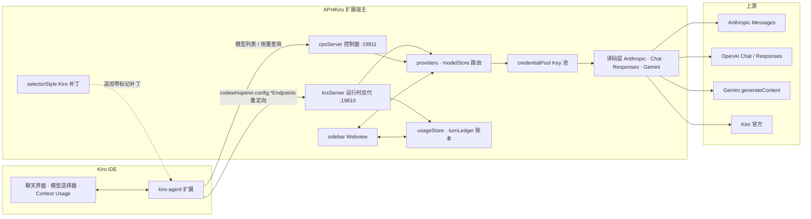
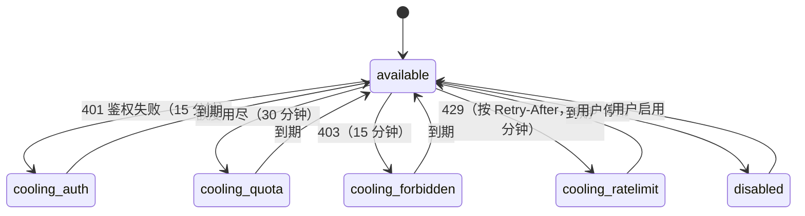

# 架构概览

本文描述 API4Kiro 的运行时结构：Kiro 的请求如何到达本扩展、如何被路由到多家上游、用量如何记账，以及为什么要给 Kiro 的前端文件打补丁。配置项参考见 [CONFIGURATION.md](CONFIGURATION.md)。

## 系统架构

- 扩展在本机回环地址起两个 HTTP 服务：**KRS**（运行时，默认 19810）承接 Kiro 的对话请求；**CPS**（控制面，默认 19811）承接模型列表、测活、用量查询。
- 启用代理时，扩展把 Kiro 的 `codewhisperer.config.krsEndpoints / cpsEndpoints / endpoints` 指向本地端口，并把原值备份到 `globalState`；关闭代理时复原。
- `package.json` 声明 `extensionDependencies: ["kiro.kiroAgent"]`，让 Kiro 工作台把本扩展与 kiro-agent 放进**同一个扩展宿主进程**——这是「通道 A」静默刷新能读到 kiro-agent 内部钩子的前提。

## 一次对话请求

1. Kiro 以 AWS eventstream 二进制帧向 KRS 发送 CodeWhisperer 请求（`cwTypes`），`eventstream.ts` 解码。
2. 若这是 Kiro 每轮附带的 simple-task **意图分类**请求且 `interceptIntentClassifier` 开启，`intentClassifier.ts` 本地应答，不打上游。
3. `modelStore` 按请求中的模型 ID 查路由表，找到拥有该模型的 provider；`credentialPool` 按该 provider 的策略（主备 / 均衡）挑一把可用凭证；OAuth 类凭证由 `oauth/index.ts` 在发送前换取新鲜 access token。
4. `imagePolicy` 检查目标模型是否在纯文本名单中，必要时剥离图片（含历史消息）。
5. 按 provider 协议译码：`translate.ts`（Anthropic）/ `openaiTranslate.ts`（Chat）/ `responsesTranslate.ts`（Responses）/ `geminiTranslate.ts`（Gemini）。思考档位由 `effort.ts` 与 `thinkingPolicy.ts` 决定字段形态；工具 schema 由 `schemaUtil.ts` 内联 `$ref`。
6. `upstream.ts` 发起流式请求；对应的 `*Stream.ts` 把上游 SSE / 类型化事件翻回 CW 事件，经 `streamShared.ts` 合成 thinking / 文本 / 工具调用，`eventstream.ts` 编码回写给 Kiro。
7. 失败处理：尚未输出任何内容时的流中断按 `autoRetry / maxRetries` 透明重发；鉴权 / 额度 / 限流类错误反馈给 `credentialPool` 标记冷却并换下一把凭证；图片被拒时把模型记入 `textOnlyModels`。
8. `turnLedger` 把一轮里的多次请求（Kiro 工具循环每次迭代都是独立 HTTP 请求）累计成一轮，轮末一次上报，Kiro 页脚显示 Est. Input / Output Tokens；`usageStore` 同时把请求写入本地账本，`contextParser` 把输入 token 按系统提示 / 历史 / 工具 / 附件等成分无损分配，供 Sankey 与 Context Usage 弹层使用。

## 模块边界

| 模块 | 职责 | 依赖 |
| --- | --- | --- |
| `extension.ts` | 激活 / 停用、命令、配置监听；providers 变化时先走通道 A，失败才提示重载 | config, endpoints, portBinder, servers, sidebar, selectorStyle, stores |
| `endpoints.ts` | Kiro 端点设置的备份 / 重定向 / 复原 | vscode globalState |
| `portBinder.ts` / `proxyIdentity.ts` | 多窗口共用端口：先到者为主实例，后到者探测端口发现是同类实例即待机；升级后旧实例被识别并让位 | net |
| `krsServer.ts` | 运行时反代与意图分类本地应答 | 协议模块, credentialPool, usageStore, contextParser, turnLedger, imagePolicy |
| `cpsServer.ts` | 模型列表广播（把推理 / 图片能力与上下文窗口编码进模型 description，供选择器徽章与弹层读取）、测活、用量查询 | providers, modelStore, usageStore |
| `providers.ts` / `credentialPool.ts` | 注册表、路由、凭证调度 | oauth/tokenStore, config |
| `providerProbe.ts` | 对草稿渠道测延迟 / 拉模型 / 测活，不写注册表 | upstream, providers |
| `modelCatalog.ts` / `modelStore.ts` | models.dev 目录缓存；聚合列表与路由表；学到的模型名单 | globalState, upstream |
| `oauth/` | 六家厂商登录（授权码 + PKCE / 设备码）、token 刷新与存储 | tokenStore（SecretStorage）, openBrowser |
| `ccSwitchImport.ts` / `sqliteReader.ts` | 只读解析 `~/.cc-switch/cc-switch.db` 导入渠道 | fs |
| `usageStore.ts` / `turnLedger.ts` / `contextParser.ts` | 账本、整轮累计、上下文分项 | cwTypes, promptStore |
| `promptStore.ts` | 提示词库（单条启用，注入 system） | globalState |
| `sidebar.ts` | Webview 四页模板与图表（趋势、Sankey、上下文卡） | 各 store, providerProbe, ccSwitchImport |
| `selectorStyle.ts` | Kiro 三处靶文件的补丁 / 复原 / 漂移检测；通道 A 刷新 | Kiro 安装目录文件 |
| `updateChecker.ts` | GitHub `releases/latest` 只读拉取、版本比较、通知 | https |
| `eventstream.ts` / `cwEvents.ts` / `cwTypes.ts` | CodeWhisperer 协议编解码与类型 | 无 |

## Key 池状态机

- 冷却是**避让**而不是封锁：冷却中的凭证不参与调度，池里其它凭证照常服务；到期自动回池，无需人工干预。
- `priority`（主备）固定用最优先的一把，挂了才切；同一会话粘住同一把凭证 2 小时，避免同一对话在不同账号间跳。
- `least-used`（均衡）为新会话选择累计使用最少的一把。

## Kiro 前端补丁

Kiro 的模型选择器不支持分组样式，Context Usage 弹层不显示真实窗口，也没有任何命令能让 kiro-agent 重拉模型列表。为此 `selectorStyle.ts` 在 Kiro 安装目录的三处文件末尾追加带 `a2k` 标记的补丁：

| 靶文件（相对 Kiro 安装目录） | 补丁内容 |
| --- | --- |
| `extensions/kiro.kiro-agent/packages/kiro-ui-agent-chat/dist/style.css` | 分组标题 / 卡片 / 弹层样式（全部限定在扩展自己的类名作用域内） |
| `extensions/kiro.kiro-agent/packages/kiro-ui-agent-chat/dist/assets/mermaid-*.js` | 选择器组头渲染；Context Usage 弹层改为读 description 里的真实窗口 |
| `extensions/kiro.kiro-agent/dist/extension.js` | 在模型配置 provider 的 setter 上挂钩子，暴露给同宿主的本扩展，用于「通道 A」静默刷新 |

约束与机制：

- **结构匹配，不写死压缩名**。Kiro 自动升级会改变压缩后的标识符（例如 1.0.411 → 1.0.437 只改了名字），补丁模板把标识符换成正则捕获组按结构匹配；调用处以捕获到的名字渲染。三处靶点**全有或全无**：任一漂移或写入失败则三处都不写，不留半套。
- **原文随身**。替换函数体时把出厂原文以 base64 写进 `a2k-orig:` 块注释，复原时解码回填并校验；CSS 与选项行用锚点式复原，不依赖当前补丁串逐字匹配。写盘走原子写入。
- **触发时机**。启用代理 / 打开样式开关 / Kiro 升级覆盖后首次激活 → 打补丁并提示重载一次；关闭代理 / 关闭 `groupHeaderStyle` → 三处复原。
- **为什么窗口关闭时不复原**。kiro-agent 是本扩展的依赖，总是先激活并直接 `require` / `<link>` 磁盘上的文件；如果在 `deactivate` 里复原，下一个窗口的 kiro-agent 拿到的永远是出厂文件，钩子永远不可达。所以窗口关闭时三份文件保持补丁态；没有本扩展运行时，补丁对 Kiro 原生行为无可见影响。

「通道 A」：面板里增删模型或改顺序后，扩展通过钩子调用 kiro-agent 的模型配置刷新（`refreshWithOutcome`，退化为 `refresh`），Kiro 右侧选择器不重载即更新；钩子不可达时才退回「提示重载窗口」。

## 多窗口

多个 Kiro 窗口共用同一对端口。启动时 `portBinder` 尝试绑定；端口已被占用时用 `proxyIdentity` 握手——对方是同类实例则本窗口待机（所有窗口的请求都由主实例服务），主实例退出后待机者接管。握手比对扩展标识与版本，升级后旧实例会被识别并让位。

## 已知限制

- 只在 Kiro 内运行（依赖内置 `kiro.kiroAgent`），纯 VS Code 不激活。
- 补丁针对 Kiro 1.0.411 / 1.0.437 的文件结构验证；Kiro 大改前端结构时补丁会因靶点不匹配而整体跳过（此时只是回到原生外观，功能不受影响），需要跟进新结构。
- 卸载扩展后三处 Kiro 文件保持补丁态（无可见影响）；如需彻底出厂，先关闭代理再卸载，或重装 Kiro。
- Antigravity（Google）登录的 client secret 不在公开仓库，从源码构建者需自备或通过 `A2K_ANTIGRAVITY_CLIENT_SECRET` 注入。
- 更新检查依赖 GitHub API 可达；匿名请求有速率限制，失败静默。
- 回归测试套件包含 Kiro 编译产物的只读副本，未随公开仓发布。
