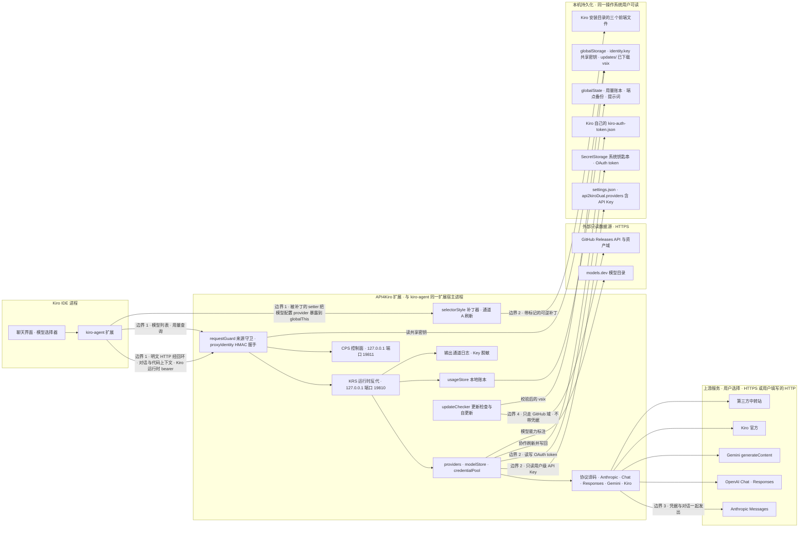

# 威胁模型与信任边界

本文面向要评估「能不能把 API4Kiro 用在敏感代码上」的人：它画出组件与数据流、列出资产、把信任假设写成明文、逐项给出已知攻击面的当前状态，并明确哪些事本项目不承诺。报告漏洞的方式见 [SECURITY.md](../SECURITY.md)；运行时结构与模块边界见 [ARCHITECTURE.md](ARCHITECTURE.md)；配置项见 [CONFIGURATION.md](CONFIGURATION.md)。

文中「状态」一栏的措辞有严格含义：**已修复（版本号）** = 修复已随该 Release 发布并有回归测试，代码位置列在同一行；**设计决策** = 有意为之，理由见架构文档；**残余** = 修复之后仍然成立的前提或边界。本文随 Release 一并更新。

一句话结论：API4Kiro 保护的是「你的凭据只发往你选定的上游」和「Kiro 文件改动可逆」；它**不**在你的机器内部建立新的隔离边界——同一操作系统账户下能运行代码的任何东西，都能读到它读到的一切。

## 1. 组件与数据流

四条信任边界：

- **边界 1：Kiro 进程 ↔ 本扩展。** 两者在同一台机器上，且因 `package.json` 声明 `extensionDependencies: ["kiro.kiroAgent"]`，被 Kiro 放进**同一个扩展宿主进程**（见 ARCHITECTURE.md「系统架构」）。Kiro 的对话请求以明文 HTTP 经回环地址到达 KRS（`endpoints.ts` 把 `codewhisperer.config.*Endpoints` 指向 `http://127.0.0.1:<port>`）。这条边界上对普通请求**没有鉴权**：任何能连上回环端口的本机非浏览器进程都能向 KRS / CPS 发请求，也能冒充 KRS 接收 Kiro 的请求（只要它先占到端口）。4.13.53 起加了两道门：`requestGuard.ts` 在两个服务入口第一行拒绝浏览器与非回环来源（`Host` 非回环、带 `Origin`、`Sec-Fetch-Site` 非 `none`、TCP 远端非回环 → 403，无 CORS 头）；多窗口让位与身份探测经同用户共享的随机密钥做 HMAC-SHA256 校验（`identityKey.ts` / `proxyIdentity.ts`）。
- **边界 2：本扩展 ↔ 本机持久化。** 设置文件、钥匙串、`globalState`、`globalStorage`、Kiro 安装目录都由操作系统按当前用户保护。本扩展不在其上再加一层加密。
- **边界 3：本扩展 ↔ 上游。** 由用户在渠道里填写 `baseUrl` 或选择厂商登录。协议由 `baseUrl` 决定：`https://` 走 Node 默认证书校验的 TLS，`http://` 明文（`upstream.ts`）。上游收到的是完整对话、工具定义与工具结果，加上对应渠道的凭据。OAuth 类渠道的 token 只发往厂商规格宿主（`providers.ts` `allowedOAuthHosts`）；Key 类渠道发往用户填写的任何地址。
- **边界 4：本扩展 ↔ GitHub。** 更新检查读 `api.github.com` 的最新 Release；自更新（4.13.54 起）把 Release 里的 `api2kiro-dual-<版本>.vsix` 下载到 `globalStorage/updates/`，校验后交给 Kiro 工作台安装（`updateChecker.ts`）。请求不带任何凭据；下载只走 `github.com` / `api.github.com` / `objects.githubusercontent.com` / `release-assets.githubusercontent.com` 的 https，30x 跳转每跳都过白名单。安装的是**可执行的扩展代码**，信任根是 GitHub 与维护者账号，见第 3 节第 6 条。

## 2. 资产清单

| 资产 | 存在哪里 | 谁能读 | 扩展怎么用 | 代码位置 |
| --- | --- | --- | --- | --- |
| 对话与代码上下文（系统提示、历史、工具定义与结果、附件） | 请求期间在内存中；在 Kiro → KRS 方向以明文 HTTP 经回环传输；开启 `debug` 时进入日志 | 本机任何能连接 `127.0.0.1:19810` 的非浏览器进程（TCP 回环不区分操作系统用户；浏览器网页被来源守卫拒绝）；所选上游 | 译码后原样发往按模型路由到的上游；`contextParser` 只统计各成分的字符与 token 数，不保存正文 | `krsServer.ts` `handleRequest` / `handleGenerate`；`requestGuard.ts` `classifyLocalRequest`；`endpoints.ts` |
| 上游 API Key | 用户级设置 `api2kiroDual.providers[].apiKey`（及 `credentials[].apiKey`），明文写在 `settings.json`；`settings.json` 不可写时退到 `globalState` 兜底。4.13.53 起该项声明 `scope: machine`：工作区设置不能覆盖、不参与 Settings Sync | 任何能读 `settings.json` 的东西：其它扩展、同用户进程 | 每次请求按协议放进鉴权头发给该渠道 `baseUrl`；读取时经 `inspect()` 只取用户级值，工作区值被忽略并记一条 warn | `providers.ts` `getProviders` / `saveProviders`；`config.ts` `readUserLevelArray` / `updateSetting`；`package.json` `contributes.configuration` |
| OAuth token（access / refresh / id token、账号邮箱等） | VS Code SecretStorage（系统钥匙串），整张表一个 JSON blob，键 `api4kiro.oauthTokens.v1`；宿主不提供 SecretStorage 时退到 `globalState` 键 `oauthTokens.v1` | SecretStorage 的 API 按扩展隔离，但底层由操作系统按用户保护；同一登录用户下的程序在多数系统上可以读取 | 请求前按 `providerId/credentialId` 取出、必要时刷新，作为 Bearer 发给该渠道的 `baseUrl`——前提是该地址的宿主在厂商规格的允许集内，否则不交出 token、渠道标为不可用；Kiro 官方账号还会与 Kiro 自己的 `~/.aws/sso/cache/kiro-auth-token.json` 协作刷新并写回（临时文件 + 改名，0600，拒绝符号链接）。4.13.53 起多窗口写入先重读钥匙串最新表再按键回放本窗口改动（blob 带 `$meta` 版本 stamp），钥匙串读失败或内容损坏时拒绝写入、原文一字不动 | `oauth/tokenStore.ts`（`TokenStoreLoadError`）；`oauth/index.ts` `ensureAccessToken`；`providers.ts` `allowedOAuthHosts` / `oauthHostRejection`；`oauth/vendors.ts` `writeBackKiroLocalToken` |
| Kiro 自己的运行时 bearer（Kiro 发给「CodeWhisperer 端点」的 `authorization` 头） | 随 Kiro 的每个请求进入 KRS，仅在内存 | 同上：任何占到 19810 端口的本机进程都会收到它 | **不转发**：Kiro 官方直通时丢弃入站 `authorization`、换成所选凭证的 token；其它协议只构造新的请求头。只记忆 `user-agent` 等非敏感头以便模拟 IDE 客户端；不落盘、不写日志 | `krsServer.ts` `kiroHeaders` / `upstreamHeaders`；`oauth/vendors.ts` `rememberKiroClientHeaders` |
| 多窗口共享身份密钥 | `globalStorage/identity.key`，32 字节随机值，`open(…, "wx")` 独占创建，类 Unix 下 0600 | 同用户进程 | 让位请求签名 `x-a2k-yield-auth` = HMAC-SHA256(key, `yield\|role\|nonce\|yieldTo`)，身份应答签名 `sig` = HMAC-SHA256(key, `ident\|role\|nonce\|version`)；值与路径不进日志与响应 | `identityKey.ts` `ensureKey` / `initIdentityKey`；`proxyIdentity.ts` `yieldSignature` / `identitySignature` / `verifyYield` |
| 本地用量账本 | `globalState` 键 `usage.ledger.v1`：逐请求明细（最多 2000 条 / 30 天）与小时桶 | 同用户进程（VS Code 的状态数据库） | 用量页的趋势、Sankey、汇总。记录 provider / 模型 / token 数 / 延迟 / 状态码 / 错误文本 / conversationId / 上下文分项**数字**；不含对话正文 | `usageStore.ts` `UsageRecord` |
| 端点备份与其它 `globalState` 项 | `globalState`：被清掉的工作区级 `codewhisperer.config.*` 原值（`endpointStash.*`）、本扩展写入过的用户级端点值（`endpointWritten.*`，4.13.53 起）、提示词库、学到的纯文本模型名单、models.dev 缓存 | 同用户进程 | 关闭代理时把工作区原值写回，并只删除本扩展自己写入的用户级值；提示词作为 system 注入每个请求 | `endpoints.ts` `stashValue` / `popStashed` / `overrideEndpoint` / `restoreEndpoint`；`promptStore.ts` |
| 已下载的更新包 | `globalStorage/updates/api2kiro-dual-<版本>.vsix`（下载中为 `.part`） | 同用户进程 | 字节数 = `Content-Length` = Release 资产 size、≤ 50 MB、`PK` 头、包内 `extension/package.json` 的 name 须为 `api2kiro-dual` 且 version 须等于 tag 版本，全部通过后才调 `workbench.extensions.installExtension`；安装成功后只保留刚装的那一个 | `updateChecker.ts` `downloadFile` / `verifyVsix` / `installLatestFromGitHub` / `cleanupUpdatesDir` |
| 调试日志 | VS Code 输出通道「API4Kiro」，由宿主写入其日志目录 | 同用户进程；你把日志贴到哪里，哪里就能读 | `debug` 关闭时不记录请求体（上游非 2xx 的错误响应前 300 字符仍以 error 级记录）。开启后记录发往上游的**完整请求体**、原始 SSE 片段与用量，单行超过 64 KiB 截断；对字段名像 key / token / authorization / secret / code / signature 的值以及 `sk-` / `AIza` / `xai-` / `GOCSPX-` / `ya29.` / JWT / Bearer 等形态打码，未知形态不识别；开启时输出通道先打一条提醒 | `log.ts` `redactText` / `redactReplacer` / `SENSITIVE_KEY_RE` / `KEY_SHAPES` / `MAX_LINE_BYTES`；`krsServer.ts` 各处 `debug("upstream request", …)` |
| Kiro 安装目录的三个前端文件 | `<Kiro>/extensions/kiro.kiro-agent/…/style.css`、`…/assets/mermaid-*.js`、`…/dist/extension.js` | 对 Kiro 安装目录有写权限的进程 | 追加 / 替换带 `a2k` 标记的片段：分组样式、选择器渲染、Context Usage 弹层、把 kiro-agent 的模型配置 provider 挂到 `globalThis.__kiroModelConfigProvider` 供「通道 A」刷新；4.13.53 起选择器渲染补丁只对 description 以 `__A2K_GRP__|` / `__A2K_MDL__|` 开头的条目生效，三处写入先算计划再按顺序提交、任一失败回滚 | `selectorStyle.ts` `syncGroupHeaderStyle` / `commitPlans` / `writeAtomic` / `carryMarker` |

## 3. 信任假设

以下假设是本项目的设计前提，写出来是为了让评估者知道边界在哪。

1. **同一操作系统用户下的其它进程是可信的。** 这是 VS Code 扩展模型本身的边界：任何扩展都能读 `settings.json`，任何同用户进程都能读状态数据库、在多数系统上也能读钥匙串，也能读到多窗口共享的 `identity.key`。本扩展不试图对抗它们。回环端口是这一假设中最薄弱的一环——它对本机所有进程可达，且**不区分用户**；多用户共享的机器上，其它用户的进程同样能连上 19810 / 19811。4.13.53 的来源守卫挡的是浏览器网页与非回环远端，不是本机进程。
2. **Kiro 本体是可信的。** 本扩展把 Kiro 的全部对话请求转发出去、修改 Kiro 的三个前端文件、与 kiro-agent 共用一个进程；反过来 Kiro 也能读到本扩展的一切。
3. **用户选择的上游与中转站是可信的。** 它们看到完整对话、工具定义与结果，以及你为该渠道配置的凭据。本扩展只保证凭据发往该渠道配置的 `baseUrl`，不判断那个地址是否值得信。是否走 TLS 由 `baseUrl` 决定。OAuth 渠道多一层限制：token 只发往厂商规格宿主，改到别处需要用户在用户设置里显式写 `allowCustomHost: true`。
4. **工作区（打开的仓库）不被视为可信。** 这一条与前三条不同：不可信仓库是日常会遇到的输入。
   - 接管 Kiro 端点时，先把工作区级与工作区文件夹级的 `codewhisperer.config.*Endpoints` 原值备份到 `globalState` 再清掉，只在用户级写入指向本地代理的值，避免仓库里的设置把 Kiro 的请求引向别处（`endpoints.ts` `overrideEndpoint`）；面板写设置只写用户级，写后回读校验，被工作区遮蔽时如实报错并退到 `globalState` 兜底（`config.ts` `updateSetting`）。
   - 4.13.53 起代理开关与含凭据 / 端点的设置项（`enabled`、`providers`、`apiKey`、`baseUrl`、`officialBaseUrl`、`officialApiKey`、`openaiBaseUrl`、`openaiApiKey`、`usagePath`）声明 `scope: machine`，工作台解析工作区 `.vscode/settings.json` 时直接跳过它们；`providers` 读取再经 `inspect()` 只取用户级值（`providers.ts` `getProviders`）。`capabilities.untrustedWorkspaces.supported: false`——受限模式（未信任）工作区下扩展不激活。
   - 4.13.53 起 OAuth token 与厂商宿主绑定（`providers.ts` `allowedOAuthHosts`）：即便某个渠道的 `baseUrl` 被改写，token 也不会发往厂商之外的地址。
5. **外部只读数据源是不可信但低风险的输入。** models.dev 目录只影响模型能力标注与档位显示；CC Switch 数据库只在用户主动点导入时被只读解析。它们都不携带本扩展的凭据。
6. **GitHub 与维护者账号是自更新的信任根。** 「检查更新」安装的是 Release 资产里的扩展包，校验只保证「下载完整、包结构合法、name / version 与 tag 一致」，**不做代码签名验证**（vsix 无签名）。能替换 Release 资产的人（维护者账号被盗、GitHub 被攻陷）能让点击「检查更新」的用户装上任意代码。不接受这一前提的用户可以不点「检查更新」，从 Release 页手动下载并核对说明里的 sha256 后安装。

## 4. 已知的攻击面与当前状态

下表前五行对应一份外部审查（2026-09-07）提出的五项问题，第 6 行是维护者自查发现的事实。六项均已在 4.13.53 处理并各有回归测试（测试套件含 Kiro 编译产物的只读副本，未随公开仓发布，见 ARCHITECTURE.md「已知限制」），状态列写修复内容与残余边界。

| # | 攻击面 | 前提 | 影响 | 当前状态 | 代码位置 |
| --- | --- | --- | --- | --- | --- |
| 1 | 多窗口让位协议无鉴权：任何本机进程向 KRS / CPS 的身份探测路径发 `?yieldTo=<更高版本号>`，持有端口的实例就会释放端口 | 攻击者进程能连接 `127.0.0.1:19810` / `19811` | 攻击者随后绑定端口，Kiro 之后的全部请求（对话、代码上下文、Kiro 运行时 bearer）都发给它；它还可以回应任意内容或伪造模型列表 | **已修复（4.13.53）**：同用户所有窗口共享 `globalStorage/identity.key`；让位请求须带服务端 30 秒一次性 nonce 与 HMAC-SHA256 签名，签名绑定端口角色（KRS 签出的让位在 CPS 端口无效，反向亦然），校验不过 → 403 且端口不放；探测方同样校验对端身份应答的签名。**残余**：同用户进程能读到密钥（第 3 节第 1 条）；为兼容旧版，新窗口仍接受自报版本低于 4.13.53 的无签名身份应答（只影响本窗口是否把对方当同类实例待机，不影响主实例的端口），全员升级后是否停止接受待定 | `identityKey.ts`；`proxyIdentity.ts` `serveIdentity` / `probeIdentity` / `verifyYield`；`portBinder.ts` `release` |
| 2 | provider `baseUrl` 与 OAuth token 未绑定；配置项未声明作用域 | 攻击者能影响有效的 `api2kiroDual.providers`——例如通过被打开仓库的 `.vscode/settings.json` | 该渠道的 OAuth access token 或 API Key 被作为 Bearer 发往攻击者指定的 `baseUrl`；对话同样发往那里 | **已修复（4.13.53）**：含凭据 / 端点的设置项声明 `scope: machine`，工作区设置不再参与合并；`providers` 读取经 `inspect()` 只取用户级值；OAuth token 只发往厂商规格宿主，`baseUrl` 被改到别处时不发 token、渠道不可用并说明原因；`allowCustomHost: true` 只能写在用户设置；受限模式工作区不激活。**残余**：Key 类渠道的 `baseUrl` 仍由用户决定，能改用户级 `settings.json` 的同用户进程仍能改它 | `package.json` `contributes.configuration` / `capabilities.untrustedWorkspaces`；`providers.ts` `getProviders` / `allowedOAuthHosts` / `oauthHostRejection`；`config.ts` `readUserLevelArray`；`oauth/index.ts` `ensureAccessToken` |
| 3 | 上游流在工具参数中途中断时，流末收尾把已累积的残缺参数作为工具调用发给 Kiro；上游在 HTTP 200 之后以 SSE 帧报错时，译码层当作成功、账本记为成功 | 上游或中转站不可靠：连接中断、限流后半途断流、以 `event: error` 形式报错 | Kiro 可能执行参数不完整的工具调用（如空参数的文件写入 / 命令）；用量与成功率统计失真 | **已修复（4.13.53）**：Anthropic / OpenAI Chat / Responses 通路里参数非空却解析不了的工具调用以 `stop:false` 发出、流末 `stopReason=MAX_TOKENS`，Kiro 走原生截断处理不执行；上游自报长度截断也不再被压成 `TOOL_USE`；四通路的流内错误帧（`{"error":…}` / `type:"error"` / `response.failed`）记账本 `ok:false`、凭证按文本分类进入冷却判定、错误文本对用户可见 | `streamShared.ts`（`CwStopReason`）；`anthropicStream.ts` / `openaiStream.ts` / `responsesStream.ts` / `geminiStream.ts` |
| 4 | 端点接管 / 复原缺所有权判断；卸载后端点可能残留 | 另一个也管理 `codewhisperer.config.*Endpoints` 的工具（如原版 API2Kiro）同时存在；或用户在代理启用状态下直接卸载本扩展 | 接管时覆盖任何已有的用户级值、复原时删除任何用户级值；卸载后 Kiro 继续指向无人监听的 `127.0.0.1:19810`——请求全部失败，且此时任何占到该端口的本机进程都能接收 Kiro 的请求 | **所有权已修复（4.13.53）**：写入时在 `globalState` 记 `endpointWritten.<key>`，复原只删除记录一致的值（或无记录时只删指向本扩展端口的值），原版 API2Kiro 与手写端点原样保留；工作区层只在有备份时写回。**卸载残留是设计决策**：`deactivate` 不复原端点（用户级端点由所有窗口共享，平台也不区分 Reload / 禁用 / 卸载），禁用或卸载前先关闭代理；README「快速开始」写明了手动清理的三个键 | `endpoints.ts` `overrideEndpoint` / `restoreEndpoint`；`extension.ts` `deactivate` |
| 5 | 用户取消请求后代理仍按 `autoRetry` 重发；已禁用 provider 仍可能被路由缓存命中 | 用户在重试窗口内取消；或在模型缓存有效期内禁用某渠道 | 取消后仍产生上游调用与费用；被禁用渠道在缓存刷新前仍收到对话 | **已修复（4.13.53）**：KRS 入口即挂客户端断开标志，上游响应头到达前的取消也会中止在途上游请求（`AbortSignal`）、不再重试或换 key、不进凭证冷却、账本记「客户端取消」；合并路由表命中时复查 owner `enabled`，刚停用的渠道在下一次列表重建前零外发 | `krsServer.ts` `clientGone`；`upstream.ts`（`signal`）；`modelStore.ts` `providerForModel` |
| 6 | KRS 对所有来源返回 `Access-Control-Allow-Origin: *` 并放行 `OPTIONS`；浏览器网页可向 `127.0.0.1` 发跨源请求 | 用户的浏览器打开了恶意网页 | 网页可用你配置的凭据经本地代理调用上游模型并读取响应，或让 CPS 做带 Key 的拉取 | **已修复（4.13.53）**：两个服务入口第一行经 `requestGuard.ts`：`Host` 非回环（含缺失）、带 `Origin`、`Sec-Fetch-Site` 非 `none`、TCP 远端非回环一律 403（`text/plain`，无任何 `Access-Control-*` 头，零外发，同服务同原因 60 秒一条 warn）。浏览器对跨源请求必带 `Origin` 与 `Sec-Fetch-Site`（`Sec-` 前缀是脚本改不了的禁止请求头），不按 UA 放行、不要求自定义头。既有 CORS 头只对通过守卫的非浏览器客户端可见 | `requestGuard.ts` `classifyLocalRequest` / `applyGuard`；`krsServer.ts` / `cpsServer.ts` 入口 |

同批（4.13.53）与安全直接相关的其它加固：

- **日志脱敏补漏**（`log.ts`）：新增 `GOCSPX-` / `ya29.` / `1//0` / `pplx-` / `AKIA` / `hf_` / `csk-` 形态，敏感键名后 ≥ 64 字的不透明长串兜底，表单体 `code=` / `code_verifier=` / `device_code=` / `assertion=`，URL userinfo 密码，嵌套 `Error` 展开，单行 64 KiB 截断，`debug` 开启时一次性提醒。
- **OAuth token 仓多窗口安全**（`oauth/tokenStore.ts`）：写入先重读钥匙串最新表再回放本窗口改动，窗口 A 刷新出的新 refresh token 不再被窗口 B 的旧内存态盖回；钥匙串读失败或内容损坏时拒绝写入而不是当作空表覆盖。
- **eventstream 解码器面对损坏帧不卡死**（`eventstream.ts`）：只信任前导 CRC 自洽的长度字段，损坏帧抛 `EventStreamDecodeError` 并重同步，超上限帧按声明长度跳过，等待大帧期间不重复拼接缓冲。
- **Kiro 补丁标记门 + 原子提交**（`selectorStyle.ts`）：补丁 JS 只对本扩展的模型列表条目生效，留盘的补丁文件对 Kiro 原生列表逐字等价于出厂；三处写入先算计划再提交，任一失败回滚。

## 5. 明确不承诺的事

- **不防同一操作系统用户下的恶意进程。** 能在你的账户下运行代码的东西，能读你的设置、钥匙串、状态数据库、共享身份密钥，能连你的回环端口，能改 Kiro 安装目录。本扩展不改变这一点；第 4 节第 1 行的加固把「顶掉主实例」的门槛从「会发一个 HTTP 请求」提高到「拿到那把共享密钥」，同用户进程仍然拿得到。
- **不防被攻陷或恶意的上游 / 中转站。** 它们看到全部对话与该渠道的凭据；本扩展不做内容过滤、不做响应真实性校验。
- **不对 Release 资产做代码签名验证。** 自更新的信任根是 GitHub 与维护者账号（第 3 节第 6 条）。
- **不对 Kiro 升级后的补丁兼容性做事先保证。** 补丁按 Kiro 编译产物的结构匹配，Kiro 大改前端时会整体跳过（回到原生外观）而不是半套生效；但「是否跳过、何时修复」只能在新版 Kiro 出现后确认。
- **调试日志开着时，请求正文会随输出通道落盘。** 脱敏只覆盖已知形态。
- **不提供多用户隔离。** 共享机器上，其它本地用户的进程与你的进程在回环端口面前是等价的。
- **不承诺外部数据源的可用性与真实性。** models.dev 或 GitHub API 不可达时相应功能静默降级。

## 6. 给用户的部署要点

- **只在你信任的机器与用户账户下使用。** 这是本扩展安全性的全部前提。
- **给本扩展用独立的、额度受限的 Key，而不是主账号 Key。** Key 池支持同一渠道放多把 Key（README「接入方式」）；单把 Key 泄露时只需在上游吊销它。厂商账号登录得到的 token 等价于账号本身，请只在个人机器上使用登录类渠道。
- **处理敏感项目时关闭 `api2kiroDual.debug`**，需要排障再临时打开，贴日志前自查。
- **代理与端点设置是用户级的，所有 Kiro 窗口共享。** 工作区里的 `.vscode/settings.json` 不能改写它们（4.13.53 起），受限模式工作区下扩展不激活；一个窗口里关闭代理，所有窗口都会回到 Kiro 原生端点。
- **卸载前先关闭代理**（设置页「启用代理」或命令 `API4Kiro: 启用 / 关闭代理`），让扩展复原 Kiro 的端点设置与前端补丁；如需彻底出厂，重装 Kiro（ARCHITECTURE.md「已知限制」）。
- **只使用 `https://` 的上游地址**，除非上游就在本机。
- **更新只从本仓库的 Release 获取。** 用面板里的「检查更新」，或从 Release 页手动下载并核对说明里的 sha256；不要安装来源不明的 vsix。
- **关注 Release 说明中的安全条目**，只使用最新 Release（[SECURITY.md](../SECURITY.md)「支持的版本」）。

## 7. 给贡献者的规则

提交涉及以下任一方面的改动时，请在 PR 描述中对照说明：

1. **新增网络监听必须只绑回环，入口必须先过来源守卫，控制类接口必须带鉴权。** 参考：KRS / CPS 以 `server.listen(port, "127.0.0.1")` 绑定（`portBinder.ts`），入口第一行 `applyGuard(req, res, role)`（`requestGuard.ts`）；让位与身份探测用共享密钥 HMAC（`proxyIdentity.ts`）；OAuth 回调服务器绑 `127.0.0.1` 与 `::1`、校验随机 `state`、拿到结果即关闭（`oauth/core.ts` `openCallbackServer`）。不要引入 `0.0.0.0` 或省略 host 的 `listen`。
2. **新增设置项若含凭据或端点，须声明 `scope: machine`，并在读取端只取用户级值。** 现有含凭据 / 端点的 `api2kiroDual.*` 项已如此声明（4.13.53），`providers` 的读取走 `config.ts` `readUserLevelArray`；新项照此办理。
3. **新增对 Kiro 文件的修改必须可逆并带标记。** 遵守 `selectorStyle.ts` 的既有约束：`a2k` / `api4kiro` 标记、被替换原文随身携带（`a2k-orig:` base64）、`writeAtomic` 临时文件 + 原子改名且失败不退化为直写、三处经 `commitPlans` 全有或全无并可回滚、按结构匹配而不写死压缩名、新的渲染补丁只对 `__A2K_` 前缀条目生效；并在 PR 中写明验证过的 Kiro 版本（[CONTRIBUTING.md](../CONTRIBUTING.md)）。
4. **不得在源码、测试夹具、文档里放任何密钥。** Antigravity client secret 的处理方式是唯一允许的模式：构建期注入、源码为空串（`esbuild.js`、`oauth/vendors.ts`）。测试数据用明显合成的值。
5. **日志只经 `log.ts` 的 `info` / `debug` / `warn` / `error` 输出**，不要直接 `console.log` 原始对象；请求头不记日志；新增可能携带密钥的字段名请补进 `SENSITIVE_KEY_RE`，新的 Key 形态请补进 `KEY_SHAPES`。
6. **不把入站请求头原样转发给上游。** 唯一的例外是 Kiro 官方直通的镜像逻辑（`krsServer.ts` `kiroHeaders`）：它先用 `drop` 集合剔除 `authorization`、`cookie` 与逐跳头，再镜像其余头并换上所选凭证的 token；新增镜像逻辑至少要做到同样的剔除。
7. **OAuth 类渠道发凭据前必须过宿主检查。** 新增厂商时把规格宿主写进 `VendorSpec.baseUrl`（`providers.ts` `allowedOAuthHosts` 由它派生），不要为某家厂商绕开 `ensureAccessToken` 里的检查。

---

相关文档：[SECURITY.md](../SECURITY.md) · [README](../README.md) · [架构概览](ARCHITECTURE.md) · [配置项参考](CONFIGURATION.md) · [参与贡献](../CONTRIBUTING.md) · [图标许可](../assets/ICON-LICENSE.md)

最后更新：2026-09-08（对应 4.13.54）
